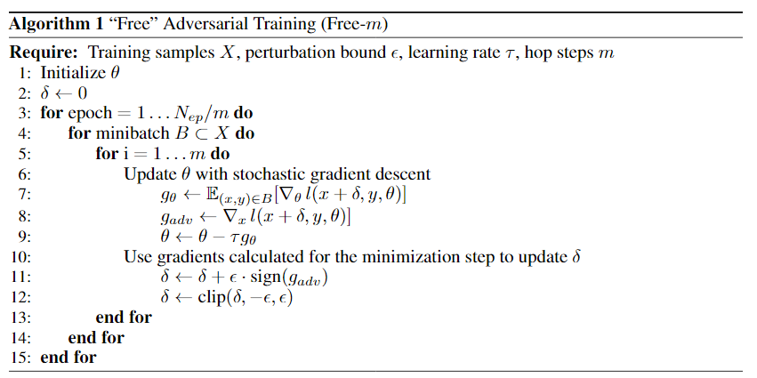

# FreeAdversarialTraining
This repo contains the PyTorch implementation of the paper 'Adversarial Training for Free!'

In this work, we train and evaluate the [ResNet-50](https://arxiv.org/abs/1512.03385) model on the Intel Image Classification dataset, which can be found [here](https://www.kaggle.com/datasets/puneet6060/intel-image-classification).

In order to run the notebook locally, make sure to meet the following library requirements:
- tqdm
- gdown
- torch

You can install them through:
```
pip install -U tqdm gdown
```
Refer to the [PyTorch website](https://pytorch.org/get-started/locally/) for local installation of PyTorch.

Talking about our work, we first train our model through a simple PyTorch training loop and afterwards using the Free Adversarial training algorithm proposed in the paper, shown below:<br>

===================================================================<br>



==================================================================

The main point and goal of this algorithm is building a model which is robust to PGD-attacks, but that at the same time is cheap and fast to train (7 to 30 times faster than other strong adversarial training methods).

Later on, we validate both models using the PyTorch's common validation loop and finally on PGD-7/-10/-20/-40 attacks. 

Results, as requested, can be seen at the very bottom of the .ipynb notebook file.

In order to quickly validate the best models without having to re-run the training loop, we do provide two pre-trained models in order to replicate the final results:
- ResNet50 with Intel Image Classification trained with Free Adversarial Training *m = 2* : [Link](https://drive.google.com/file/d/1U_dBfCp8P-DmLnvQ1qtuT84bVRoXgBf8/view?usp=share_link) (*~180 MB*)
- ResNet50 with Intel Image Classification trained with Free Adversarial Training *m = 3* : [Link](https://drive.google.com/file/d/1rT0O5Qz0ABDMCd3GeTrxm3S6kEs0sifz/view?usp=share_link) (*~180 MB*)
- ResNet50 with Intel Image Classification trained with Free Adversarial Training *m = 5* : [Link](https://drive.google.com/file/d/13Lv0Yc_O9YX5c54EqekXZvgldJ63s_W4/view?usp=share_link) (*~180 MB*)
- ResNet50 with Intel Image Classification trained with standard PyTorch Training: [Link](https://drive.google.com/file/d/1u9xHf9lPuTOJdANUE0q9aDPY9zNi0jYd/view?usp=share_link) (*~180 MB*)

For testing, simply go to the "Validation (for testing purposes)" section in the notebook file, load the model downloaded earlier and run the validation cell with the desired K-value for PGD attack. 
